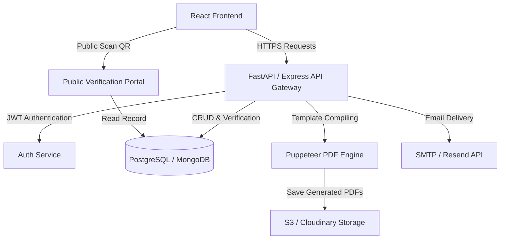
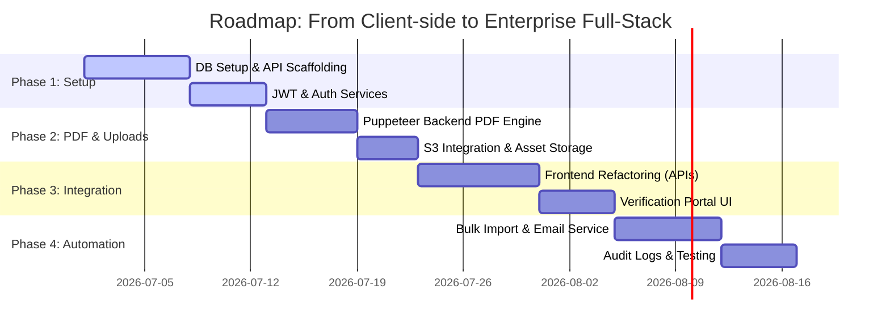

# Full-Stack Document Generation & Verification Portal
## Architectural Proposal & Feature Expansion Plan

This document outlines the architectural plan to upgrade the existing **Magizh Technologies Document Generator** from a client-side utility to a secure, enterprise-grade, full-stack application. It analyzes the current frontend structure, highlights limitations, and presents a detailed proposal for backend design, security, databases, verification, and automation.

---

## 1. Current Frontend Analysis
The existing application (`certificate_front`) is a React utility built with Vite, TypeScript, Tailwind CSS, and Radix UI components (Shadcn patterns). 

### Key Behaviors Observed:
* **Client-Side Routing:** Managed using `react-router-dom` (v6) with routes for:
  * Home Page (`/`): Service directories, links, and quick descriptions.
  * Certificate Generator (`/certificate` & `/generate-certificate`): Captures names, dates, courses, IDs, and loads certificate previews.
  * Offer Letter (`/offer-letter/form` & `/preview`): Allows toggling between employment and internship offers.
  * Relieving Letter (`/relieving-letter/form` & `/relieving-letter/preview`): Generates service completion documents.
  * Fee Receipt (`/receipt`): Calculates amounts, auto-converts values to words (Rupees/Paise), and prints billing receipts.
* **Mock Authentication:** The `AuthContext.jsx` file implements a basic admin check against local environment variables (`VITE_ADMIN_USERNAME` / `VITE_ADMIN_PASSWORD`). Upon success, it writes a `dummy-jwt-token` into `localStorage`.
* **State & Query Params Passing:** Form data is captured in local component states and passed to preview templates using URL query strings (e.g., `/preview?employeeName=John+Doe&designation=Engineer...`).
* **PDF Engine:** Document templates are rendered directly in DOM and converted to PDFs or PNGs client-side using `html-to-image`, `jsPDF`, `html2pdf.js`, and `react-to-print`.
* **Static Verification Hook:** The Generated Certificate loads a verification QR code from an external Render service: `https://magizh-certification-app.onrender.com/generate_qr?id=${certificateId}`.

---

## 2. Core Limitations of the Current Setup

While the current frontend has a premium design and works well for manual generation, it exhibits critical bottlenecks for business-level operations:

> [!WARNING]
> **No Data Persistence:** Document data is not saved. If a user refreshes or closes the page, the record of that receipt, offer letter, or certificate is gone forever.
>
> **Security & Tamper Risks:** Because PDF generation happens client-side and parameters are read from the URL, anyone can manipulate URL parameters to forge certificates or receipts with arbitrary details.
>
> **Client-Side PDF Variance:** Heavy client-side rendering (`jsPDF` / `html2canvas`) depends on the user's browser, screen resolution, operating system, and installed system fonts. This causes layout shifts, misalignments, or low-resolution images in exported PDFs.
>
> **Hardcoded & Single-User Auth:** The portal cannot support multiple HR managers, financial officers, or students because credentials are static, single-admin environment variables.
>
> **Lack of Tracking & Revocation:** If a certificate or offer letter is issued in error, there is no way to cancel, edit, or revoke it.

---

## 3. Proposed Full-Stack Architecture

To address these limitations, we propose establishing a unified backend layer linked to a relational database.



### Proposed Backend Tech Stack:
1. **Backend Engine (FastAPI or Node.js/Express):**
   * *Option A (FastAPI):* Leverages the existing `main.py` stub in the workspace. Great for high performance, standard async support, and auto-generated OpenAPI (Swagger) docs.
   * *Option B (Node.js/Express with TypeScript):* Excellent synergy with the React frontend, allowing shared TypeScript interfaces and code reuse.
2. **Database (PostgreSQL):**
   * Ideal for document management and transactions. Relational integrity ensures receipts are tied correctly to users, and certificates are logged with unique indexes.
3. **Cloud Storage (AWS S3 / Supabase Storage):**
   * Stores static assets (signatures, official stamps, logos) and acts as an archival repository for final, signed PDFs.
4. **PDF Generation (Puppeteer/Headless Chromium):**
   * Moving PDF generation to the backend guarantees that the output layout is identical, high-definition, and tamper-proof, regardless of client browser configurations.

---

## 4. Key Features to Implement

### A. Centralized Management Dashboard
An admin-facing panel that serves as the central hub:
* **Stats Panel:** Total certificates issued, pending offer letters, and gross revenue generated (from receipts).
* **Document Explorer:** A searchable, paginated table of all issued documents with status tags (`Active`, `Revoked`, `Expired`, `Pending Signature`).
* **Filters:** Filter by document type, issue date range, course, or recipient name.

### B. Secure, Public-Facing Verification Portal
Every document should feature a secure verification link and QR code pointing to `https://portal.magizhtechnologies.com/verify/<unique_hash_or_uuid>`:
* When scanned, this route loads from the database and displays a read-only, official verification screen showing the authentic recipient name, document type, issue date, and validity.
* Displays a clear "VERIFIED" badge (green) or "REVOKED" badge (red) to combat forgery.

### C. Role-Based Access Control (RBAC)
Support multiple users with specific roles:
* **Super Admin:** Manage HR/Finance user accounts, edit templates, upload signatures/seals, and revoke certificates.
* **HR Manager:** Access to generate, view, and email **Offer Letters**, **Relieving Letters**, and **Experience/Internship Certificates**.
* **Financial Officer:** Access to generate **Fee Receipts** and **Pay Slips**.
* **Candidate/Student (Optional Client Portal):** Login to view and download only their own certificates, letters, and pay slips.

### D. Bulk Upload & Batch Generation
* Allow HR/Admins to download a CSV template, populate it with 50+ students/employees, and upload it.
* The backend will validate fields, batch-insert into the database, generate certificates, and queue them for automated email delivery.

### E. Automated Email Delivery
* Integration with an email service provider (e.g., **Resend**, **SendGrid**, or **Nodemailer**).
* Upon document generation, the portal automatically formats a custom email template ("Congratulations! Here is your Certificate of Completion...") containing a secure download button or PDF attachment.

---

## 5. Proposed Database Schema

To implement persistence, we can structure the database with the following core entities:

```sql
-- 1. Users & Authentication
CREATE TABLE users (
    id UUID PRIMARY KEY DEFAULT gen_random_uuid(),
    name VARCHAR(100) NOT NULL,
    email VARCHAR(150) UNIQUE NOT NULL,
    password_hash VARCHAR(255) NOT NULL,
    role VARCHAR(20) NOT NULL CHECK (role IN ('super_admin', 'hr', 'finance', 'recipient')),
    created_at TIMESTAMP DEFAULT CURRENT_TIMESTAMP
);

-- 2. Master Document Log (For tracking all certificate and document generations)
CREATE TABLE documents (
    id UUID PRIMARY KEY DEFAULT gen_random_uuid(),
    document_type VARCHAR(50) NOT NULL, -- 'experience_cert', 'intern_cert', 'offer_letter', 'relieving_letter', 'receipt'
    recipient_name VARCHAR(150) NOT NULL,
    recipient_email VARCHAR(150),
    issued_by UUID REFERENCES users(id),
    issue_date DATE NOT NULL,
    status VARCHAR(20) DEFAULT 'active' CHECK (status IN ('active', 'revoked', 'expired')),
    metadata JSONB, -- Stores specific attributes (e.g., salary, course, duration, amount)
    unique_hash VARCHAR(64) UNIQUE NOT NULL, -- SHA256 code printed on document for security
    pdf_url VARCHAR(255), -- Link to stored PDF in S3
    created_at TIMESTAMP DEFAULT CURRENT_TIMESTAMP
);

-- 3. Audit Logs (For compliance and tracking modifications)
CREATE TABLE audit_logs (
    id SERIAL PRIMARY KEY,
    user_id UUID REFERENCES users(id),
    action VARCHAR(100) NOT NULL,
    document_id UUID REFERENCES documents(id) ON DELETE SET NULL,
    ip_address VARCHAR(45),
    timestamp TIMESTAMP DEFAULT CURRENT_TIMESTAMP
);
```

### JSONB Metadata Examples by Type:
* **Internship/Experience Certificate:**
  ```json
  {
    "course": "Full Stack Developer",
    "grade": "A+",
    "duration_months": 3
  }
  ```
* **Fee Receipt:**
  ```json
  {
    "receipt_number": "RCPT-9821",
    "amount": 25000.00,
    "payment_method": "UPI",
    "description": "Term-II Course Fee"
  }
  ```

---

## 6. Key Backend API Endpoints (RESTful)

### `/api/auth`
* `POST /login` -> Validates email/password, issues secure HTTP-only cookies containing access and refresh tokens.
* `POST /logout` -> Clears cookies.
* `GET /me` -> Returns active user data and authorization role.

### `/api/documents`
* `GET /` -> Retrieve documents list with query parameters for filtering and search (Admin/HR only).
* `POST /generate` -> Accept document details, calculate inputs, save record, queue PDF creation, and trigger email distribution.
* `GET /:id` -> Retrieve full document details and metadata.
* `PUT /:id/revoke` -> Change status to `revoked` and create audit log entry.
* `POST /bulk-import` -> Process multipart form-data (CSV/Excel) for batch generation.

### `/api/public`
* `GET /verify/:hash` -> Open verification check (rate-limited, requires no login) returns verification status + matching document data.

---

## 7. Security & Compliance Best Practices

* **Digital Signatures:** Incorporate digital signature hashes into PDFs using server-side keys. If someone modifies the text content of the PDF, the signature will break.
* **Rate Limiting:** Protect public verification APIs and login endpoints from brute-force scans using Redis-based rate limit rules.
* **CORS & Cookies:** Restrict CORS policies to company domains. Keep JWTs in secure `HttpOnly`, `SameSite=Strict`, `Secure` cookies to prevent XSS-based theft of sessions.
* **Audit Trails:** Never hard-delete documents. Perform soft deletes (`status = 'revoked'`) so administrative history remains untampered for future audits.

---

## 8. Implementation Roadmap



### Phase 1: Database & Core APIs (Week 1-2)
* Scaffold the FastAPI app inside `certification_backend`.
* Configure PostgreSQL instance and run migrations for tables.
* Implement JWT authorization endpoints and backend user registration.

### Phase 2: Storage & Document Engines (Week 2-3)
* Setup AWS S3 bucket and credentials.
* Develop the headless-chrome backend renderer to turn HTML templates into clean, standardized PDFs.
* Store generated PDFs in the cloud and return URLs.

### Phase 3: Frontend Refactoring & Integration (Week 3-4)
* Replace frontend `localStorage` authentication logic with actual API auth.
* Bind form components (`OfferLetterForm`, `ReceiptForm`, `CertificatePage`) to submit data to `/api/documents/generate` instead of client-side print screens.
* Connect public QR scanning links directly to `/verify/:hash`.

### Phase 4: Automation, Verification & Testing (Week 4-5)
* Build Excel/CSV parsing helpers for batch creation.
* Integrate email dispatcher with custom CSS email layouts.
* Conduct extensive security testing (CORS, JWT validation checks, SQL Injection guards) and push to production (e.g., Render/AWS + Vercel).
